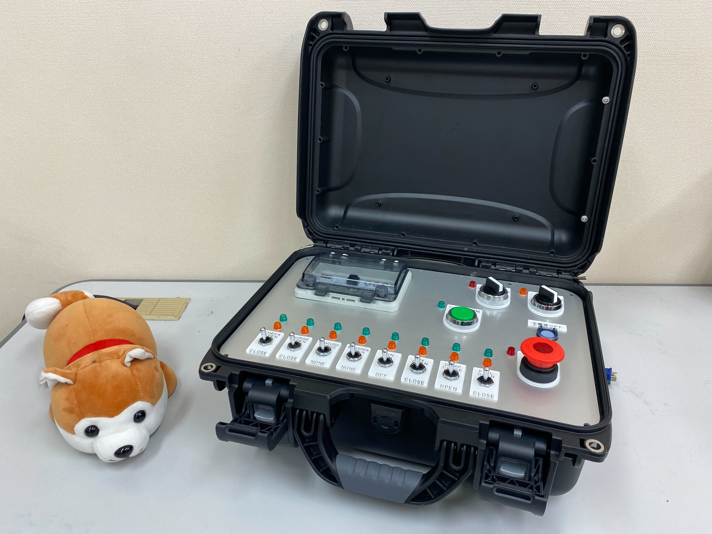
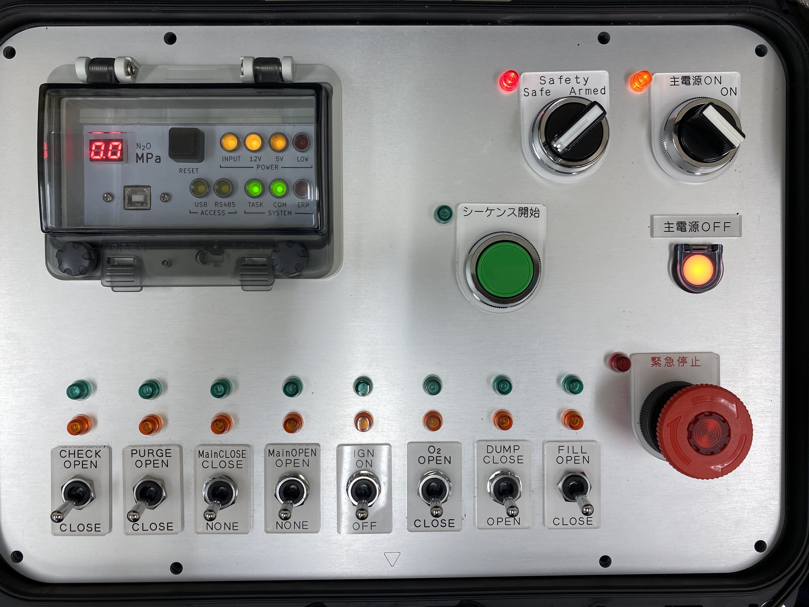
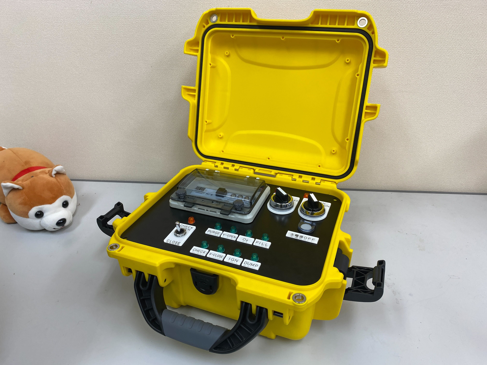
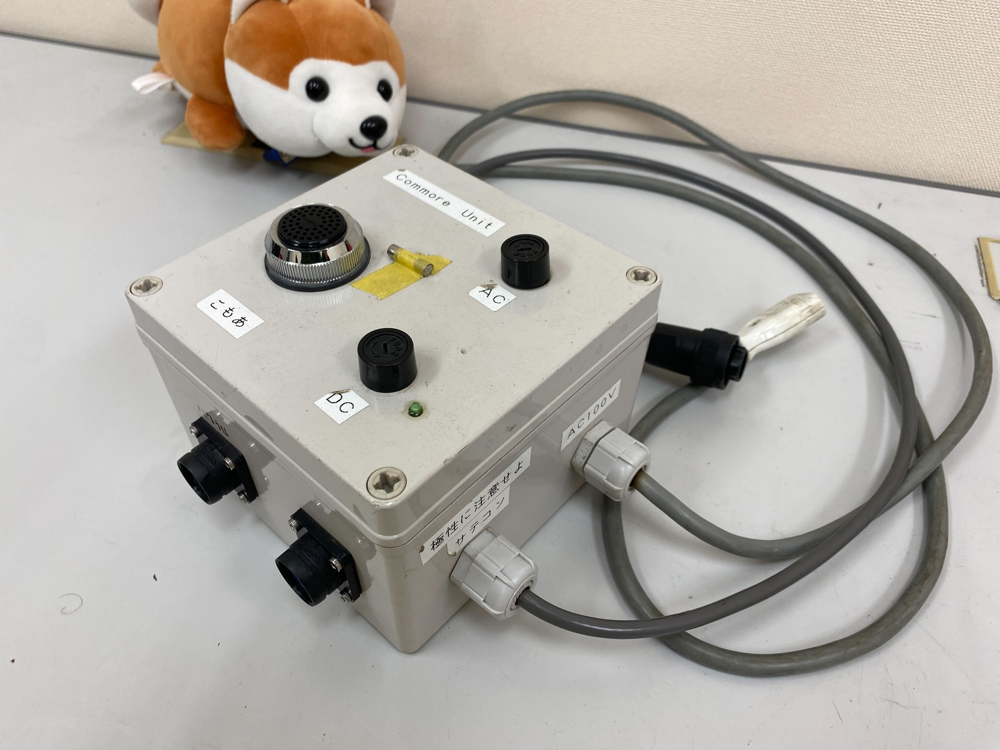
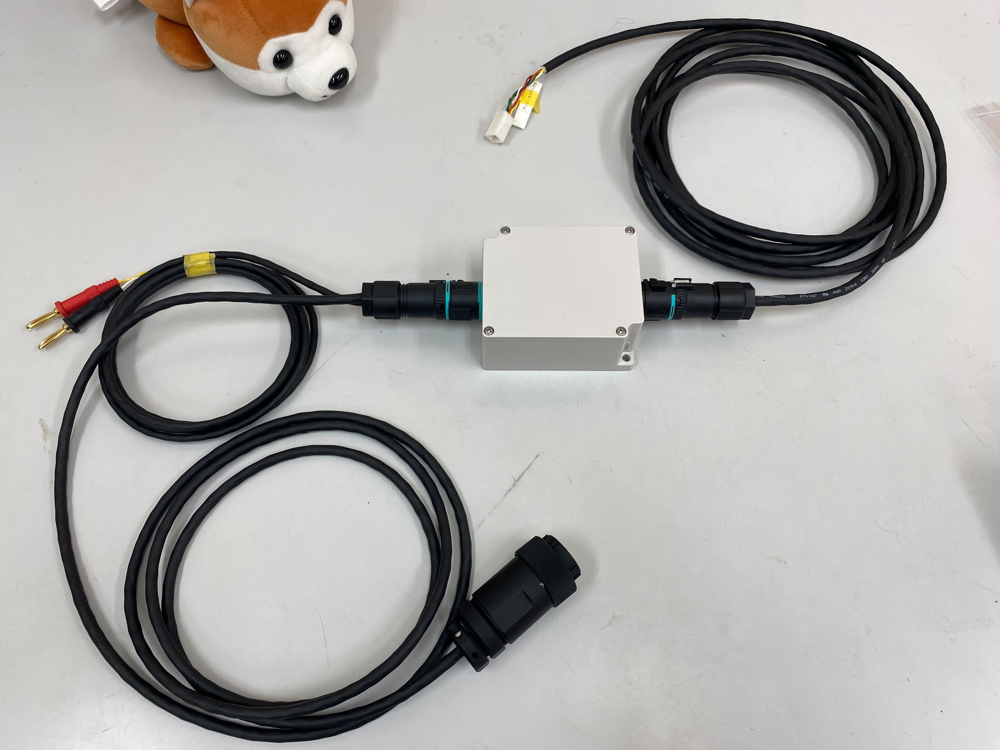

# 第6世代 Ground Support Equipment (GSE) 仕様

## ランチコントローラー

ロケットから離れた点火所から酸化剤充填を行うコントローラーです．
セミオートマチックシークエンスに対応しています．

### 電源

電源はポータブルバッテリーから得る想定で設計されていますが，12 V（DC）の AC アダプターを使用できればどのような電源でも構いません．
DCジャックは**センタープラス**なので，センタープラスのACアダプターを使用してください．

### 通信

サテライトコントローラーとRS485を用いて有線通信しています．

|通信仕様||
|-|-|
|想定通信距離|100 m 以上|
|ケーブル|LANケーブル（ツイストペア・シールド無し）|
|コネクタ|RJ45モジュラージャック|

### インターフェース

ランチコントローラーには各種装置と接続するためのインターフェースがついています．

#### 左側面

|名称|個数|説明|
|-|-|-|
|2.1 mm DCジャック|3|充填確認スイッチが接続できます．|
|3.5 mm ステレオミニジャック|1|外部音声出力ポートです．AUXケーブルを使用できます．|

#### 右側面
|名称|個数|説明|
|-|-|-|
|2.1 mm DCジャック|1|電源入力に使います．参照：[電源](#電源)|

#### 背面
|名称|個数|説明|
|-|-|-|
|RJ45モジュラージャック|1|通信ケーブルを接続し，サテライトコントローラーと有線通信を行います．|

## パネル

ロケットを打上げる操作パネルとなっています．

画像左上はステータスパネルとなっており，GSEの状態確認ができるようになっています．プログラムを書き込み時やデバッグ時にハッチを開けて USB Type-B を介してマイコンにアクセスできるようになっている．

> [!NOTE]
> シリアルポートはSerialを使用できます．
> 
> Serial.begin(115200)で初期化．
> Serial.println()で任意の値を取得することができます．

## サテライトコントローラー

ロケットの近くに設置され，ランチコントローラーからの指令を受けて，各種装置へ出力を行う中継装置です．

最大6個の電磁弁に対応しています．

#### 電源
ランチコントローラーと同様に電源はポータブルバッテリーから得る想定で設計していますが，12 V(AC)アダプターを使用できればどのような電源でも構いません．
DCジャックは**センタープラス**なので，センタープラスのACアダプターを使用してください．

#### 通信
ランチコントローラーとRS485を用いて通信しています．

|通信仕様||
|-|-|
|想定通信距離|100 m 以上|
|ケーブル|LANケーブル（ツイストペア・シールド無し）|
|コネクタ|RJ45モジュラージャック|

#### インターフェース

サテライトコントローラーは中継装置の役割をしているため各種装置へつながる便利なインターフェースがついています．

#### 左側面

|名称|個数|説明|
|-|-|-|
|コネクタ（4ピン・大）|1|アンビリカルケーブルを接続します．IGN，バルブOPENの信号を出力します．|

#### 右側面
|名称|個数|説明|
|-|-|-|
|2.1 mm DCジャック|1|電源入力に使います．参照：[電源](#電源)|

#### 背面
|名称|個数|説明|
|-|-|-|
|RJ45モジュラージャック|1|通信ケーブルを接続し，サテライトコントローラーと有線通信を行います．|
|コネクタ（2ピン）|1|こもあユニットへ接続します．12 Vを出力します．|
|コネクタ（4ピン・小）|1|将来的に亜酸化窒素の圧力を読み取る圧力センサが取り付けられます．|
|コネクタ（11ピン）|1|電磁弁ユニットへ接続します．|

## こもあユニット

1次側に信号が入力されると2次側にAC100V出力します．リレーと同じ役割をしています．

## アンビリカルケーブル

ロケットに電力と信号を供給するためのケーブルです．画像中央のBOXを基準とし，右側がロケットに接続（搭載計器）され，左側が電源とサテライトコントローラーに接続されます．左側にある黒色のコネクタが4ピンコネクタ・大です．
