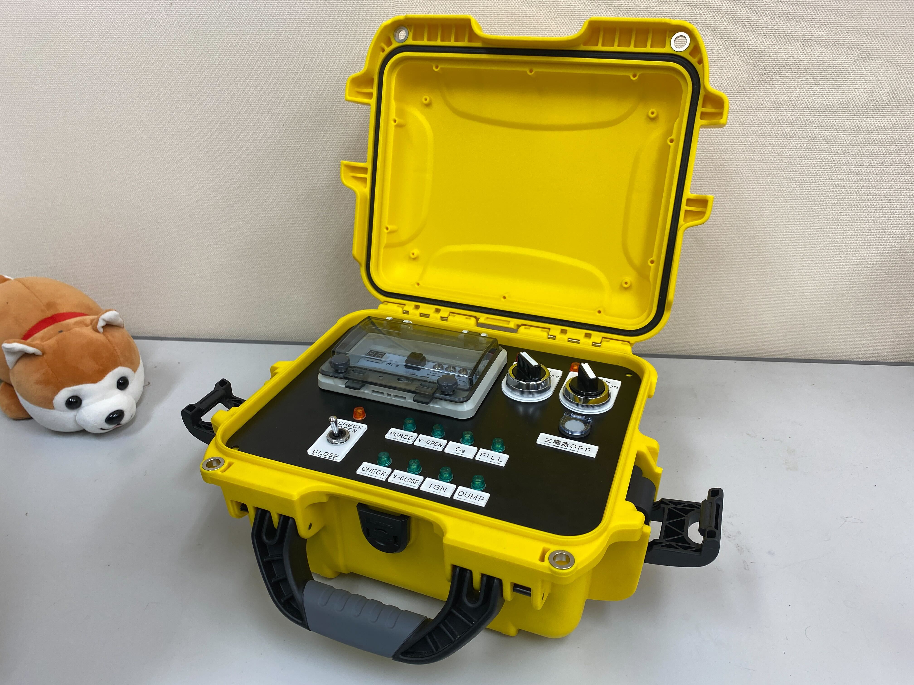

# 第6世代 Ground Support Equipment (GSE) 構成一覧

## ランチコントローラー

ロケットから離れた点火所から酸化剤充填を行うコントローラーです．

セミオートマチックシークエンスに対応しています．

## パネル

## サテライトコントローラー

ロケットの近くに設置され，ランチコントローラーからの指令を受けて，各種装置へ出力を行う中継装置です．

最大6個の電磁弁に対応しています．

## こもあユニット

1次側に信号が入力されると2次側にAC100V出力します．リレーと同じ役割をしています．

## アンビリカルケーブル

ロケットに電力と信号を供給するためのケーブルです．
