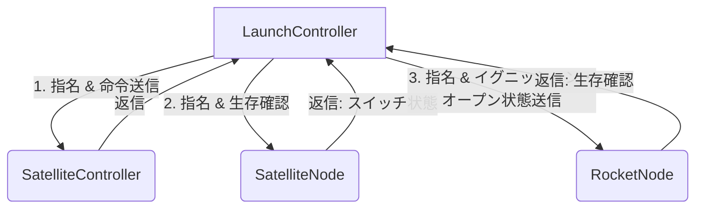

# ロケット搭載用子機（RocketNode）を追加する実装手順書

このドキュメントでは、RS-485通信（MsgPacketizer）によるポーリング方式を維持したまま、**3台目の子機（ロケット搭載用ノード：RocketNode）を追加し、イグニッション（IGNITER）およびメインバルブ開（OPEN）の制御状態を送信・同期する**ための具体的な実装方法をまとめます。
また、ロケットの発射に伴いケーブルが離脱（通信断）することを前提とし、**通信途絶時のエラー処理（フェールセーフ発動）は行わず、単なる通知に留める**仕様とします。

---

## 1. 全体設計

ポーリング方式では、「親機が順番に指名し、指名された子機のみが返事をする」というルールを守ります。
現在、親機は2台の機器を交互に指名していますが、これを**3台の機器を順番に指名する状態遷移**に拡張します。



---

## 2. 実装手順（親機：LaunchController側）

### ① パケットID（Packet Enum）の定義追加
`LaunchController2.0.cpp` 内の `communication::Packet` 列挙体に、ロケットノード用のパケットIDを追加します。

```cpp
namespace communication
{
  enum class Packet : uint8_t
  {
    // ... 既存の定義 ...
    LIMIT_SWITCH_SYNC = 10,
    COM_CHECK_L_TO_N = 11,
    COM_CHECK_N_TO_L = 12,

    // ★新規追加
    COM_CHECK_L_TO_RN = 13,       // 親機 ➔ ロケットノード 生存確認
    COM_CHECK_RN_TO_L = 14,       // ロケットノード ➔ 親機 生存確認
    ROCKET_NODE_STATE_SYNC = 15,  // 親機 ➔ 状態同期（イグニッション/OPEN状態）
  };
}
```

### ② タイムアウト管理変数とフラグの追加
ロケットノードの生存確認を監視するための変数を用意します。また、離脱したことを一度だけ通知するためのフラグも用意します。

```cpp
namespace communication
{
  // ... 既存の定義 ...
  unsigned long preReceivedTime_Node = 0;
  
  // ★新規追加
  unsigned long preReceivedTime_RocketNode = 0; 
  bool isRocketNodeDisconnected = false; // 離脱検知済みフラグ
}
```
`setup()` 内で `communication::preReceivedTime_RocketNode = millis();` として初期化しておきます。

### ③ ポーリングタスク（pollingTask）の拡張（3択へ）
現在交互に切り替えている処理を、3つの状態をローテーションするように変更します。また、ロケットノードのターンで `IGNITER`（`control::igniter.isRaised()`）および `OPEN`（`control::open.isRaised()`）の状態を1バイトにまとめて送信します。

```cpp
void communication::pollingTask()
{
  static uint8_t pollTarget = 0; // 0: Controller, 1: SatelliteNode, 2: RocketNode

  if (pollTarget == 0)
  {
    // ----------------------------------------------------
    // 1. SatelliteController への送信
    // ----------------------------------------------------
    // ... 既存コード ...
  }
  else if (pollTarget == 1)
  {
    // ----------------------------------------------------
    // 2. SatelliteNode への送信（生存確認）
    // ----------------------------------------------------
    // ... 既存コード ...
  }
  else if (pollTarget == 2)
  {
    // ----------------------------------------------------
    // 3. ロケットノード（RocketNode）への送信（状態同期 ＆ 生存確認）
    // ----------------------------------------------------
    // IGNITER（イグニッション）と OPEN（オープン）の状態を取り出し、ビットに割り当てる
    // Bit0: IGNITER (1=ON / 0=OFF)
    // Bit1: OPEN (1=ON / 0=OFF)
    uint8_t syncState = 0;
    if (control::igniter.isRaised()) syncState |= (1 << 0);
    if (control::open.isRaised()) syncState |= (1 << 1);

    communication::enableOutput();
    // 状態データと、呼びかけ（COM_CHECK）を送信
    MsgPacketizer::send(Serial1, static_cast<uint8_t>(communication::Packet::ROCKET_NODE_STATE_SYNC), syncState);
    MsgPacketizer::send(Serial1, static_cast<uint8_t>(communication::Packet::COM_CHECK_L_TO_RN));
    Serial1.flush(); // （環境により flush のフリーズ対策が必要な場合は delay に変更）
    communication::disableOutput();
  }

  // ターゲットを 0 ➔ 1 ➔ 2 ➔ 0 ... とローテーションする
  pollTarget = (pollTarget + 1) % 3;
}
```

### ④ 受信コールバックの登録
親機の `setup()` でロケットノードからの返信（`COM_CHECK_RN_TO_L`）を受けるコールバックを登録します。

```cpp
// ロケットノードからの生存確認パケット受信時の処理
void communication::onComCheckRocketNodeReceived()
{
  communication::preReceivedTime_RocketNode = millis(); // 時刻を更新
  
  if (communication::isRocketNodeDisconnected) {
      communication::isRocketNodeDisconnected = false;
      Serial.println("[INFO] RocketNode Connected");
  }
}
```

`setup()` 内に登録コードを追加します。
```cpp
MsgPacketizer::subscribe(
    Serial1, static_cast<uint8_t>(communication::Packet::COM_CHECK_RN_TO_L),
    &communication::onComCheckRocketNodeReceived);
```

### ⑤ エラー処理を「行わず通知のみ」にする
フェールセーフ関数 `communication::onComCheckFailed()` において、ロケットノードのタイムアウト時は**エラー状態（赤色ランプ等）に遷移させず、単なるシリアル通知のみ**とします。

```cpp
void communication::onComCheckFailed()
{
  bool controllerTimeout = (millis() - communication::preReceivedTime > communication::timeout);
  bool nodeTimeout = (millis() - communication::preReceivedTime_Node > communication::timeout);
  
  // ロケットノードのタイムアウト判定
  bool rocketNodeTimeout = (millis() - communication::preReceivedTime_RocketNode > communication::timeout);

  // 既存のノード（ControllerとSatelliteNode）がタイムアウトした場合は致命的エラー
  if (controllerTimeout || nodeTimeout)
  {
    communication::statusLamp.off();
    error::statusLamp.on();
    // ... エラー時の安全処理 ...
  }
  
  // ロケットノードがタイムアウトした場合はエラーにせず、通知のみ行う
  if (rocketNodeTimeout && !communication::isRocketNodeDisconnected)
  {
    communication::isRocketNodeDisconnected = true;
    Serial.println("[INFO] RocketNode Disconnected (Umbilical Released)");
  }
}
```

---

## 3. 実装手順（子機：RocketNode側）

ロケットノード側のプログラムでは、話しかけられた時の返信と、受け取ったデータのパースを行います。

```cpp
#include <Arduino.h>
#include <MsgPacketizer.h>

enum class Packet : uint8_t {
  COM_CHECK_L_TO_RN = 13,
  COM_CHECK_RN_TO_L = 14,
  ROCKET_NODE_STATE_SYNC = 15,
};

// 親機から送られてきた状態を保存する変数
bool isIgniterActive = false;
bool isOpenActive = false; // 適当に isOpenActiveって書いてる

// 状態データ受信時のコールバック
void onStateSyncReceived(uint8_t syncState) {
  isIgniterActive = (syncState >> 0) & 0x01; // Bit0からIGNITERの状態を抽出
  isOpenActive    = (syncState >> 1) & 0x01; // Bit1からOPENの状態を抽出

  // 受信した情報をそのままCANに流す
  // 1. イグニッション状態の送信
  can.sendIgnition(isIgnitionActive);

  // 2. メインバルブの状態の送信
  can.sendValveMode(isOpenActive); // 適当に isOpenActiveって書いてる
}

// 親機からの生存確認受信時のコールバック
void onComCheckReceived() {
  // 親機に対して「生きてるよ！」の返事を即座に返す
  // （※RS485モジュールの送受信切り替えピン DERE の制御）
  digitalWrite(PIN_RS485_DERE, HIGH); 
  MsgPacketizer::send(Serial1, static_cast<uint8_t>(Packet::COM_CHECK_RN_TO_L));
  Serial1.flush();
  delay(2);
  digitalWrite(PIN_RS485_DERE, LOW);  
}

void setup() {
  Serial1.begin(115200);
  pinMode(PIN_RS485_DERE, OUTPUT);
  digitalWrite(PIN_RS485_DERE, LOW); // 初期状態は受信モード

  // コールバックの登録
  MsgPacketizer::subscribe(Serial1, static_cast<uint8_t>(Packet::ROCKET_NODE_STATE_SYNC), &onStateSyncReceived);
  MsgPacketizer::subscribe(Serial1, static_cast<uint8_t>(Packet::COM_CHECK_L_TO_RN), &onComCheckReceived);
}

void loop() {
  MsgPacketizer::parse(); // 通信データの解析
}
```

---

## 4. 動作確認と注意点

1. **離脱時の挙動：**
   ロケットが打ち上がりケーブル（アンビリカル）が抜けると通信が途絶え、LaunchController側で `rocketNodeTimeout` が `true` になります。このときシステム異常停止（フェールセーフ）は発生せず、シリアルモニタに `[INFO] RocketNode Disconnected (Umbilical Released)` が出力されるだけになります。
2. **パケットIDの競合：**
   `LaunchController` と `RocketNode` 間で `Packet` の番号（13, 14, 15）が完全に一致していることを確認してください。
