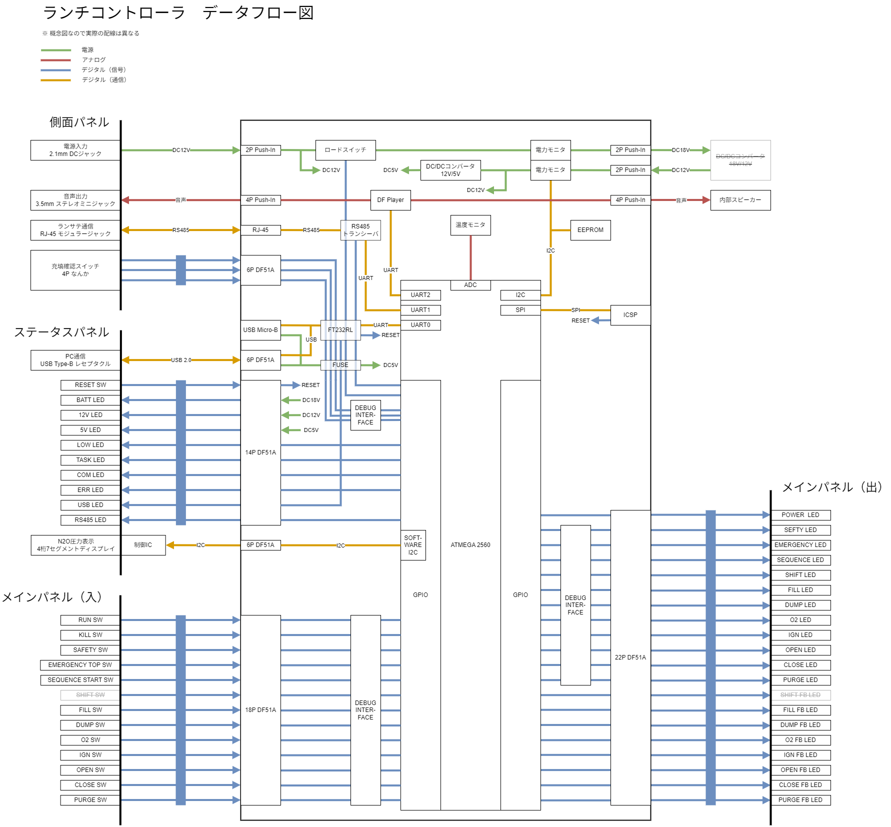
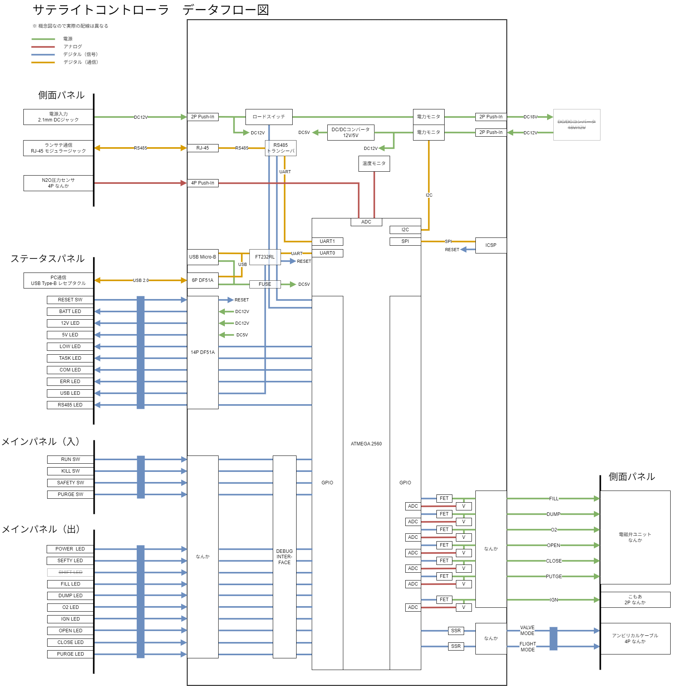

# 第6世代GSE

これまで運用してきたGSE(Ground Support Equipment | 地上支援装置)から

- 小型化
- バッテリーからの給電
- Arduinoでの開発

に対応しました．

前GSEから，セミオートマチックシークエンスも引き継いでいます．

## 主な仕様

### 基本構成
- ランチコントローラー
  - 人間が操作する．セミオートマチックシークエンスに対応．
- サテライトコントローラー
  - ランチコントローラーの指令を下記ユニットに伝える中継装置．
- 電磁弁ユニット
  - マニホールドと電磁弁で構成された装置．
- 空圧弁ユニット
  - 2つの空圧弁とニードルバルブで構成される装置．
- こもあユニット
  - 入力信号が伝達されるとネオントランスを駆動させる装置．イグニッションを担当．
- 圧力センサ
  - N2Oの圧力を測定．空圧弁ユニット内の配管に取り付ける．
- アンビリカルケーブル
  - ロケットとGSE間で通信を行う．

### 共通
- 通信
  - RS485
    - 半2重, 2線式
  - 通信ケーブル
    - LANケーブル（ツイストペア）
    - シールド無し
  - 想定通信距離
    - 100 m
- 電源
  - DC12V

### ランチコントローラー
- 音声出力
  - 3.5 mm ステレオミニジャック
  - 内蔵スピーカー
- 充填確認
  - NO(=Normally Open)プッシュスイッチ
    - モーメンタリ
- コネクタ
  - 背面 RJ45モジュラージャック >> 通信ケーブル
  - 右側面 DCジャック >> ACアダプター(12V)
  - 左側面 DCジャックx3 >> 充填確認スイッチ
  - 左側面 3.5 mm ステレオミニジャック >> スピーカー

### サテライトコントローラー
- コネクタ
  - 背面 2ピン >> こもあユニット
  - 背面 4ピン >> 圧力センサ
  - 背面 RJ45モジュラージャック >> 通信ケーブル
  - 背面 11ピン >> 電磁弁ユニット
  - 右側面 DCジャック >> ACアダプター（12V）
  - 左側面 4ピン >> アンビリカルケーブル

# ドキュメント

## データフロー

### ランチコントローラー

### サテライトコントローラー

## 手順書

[第6世代GSE手順書](./Documents/Gen6GSEManual-Elec.md)

