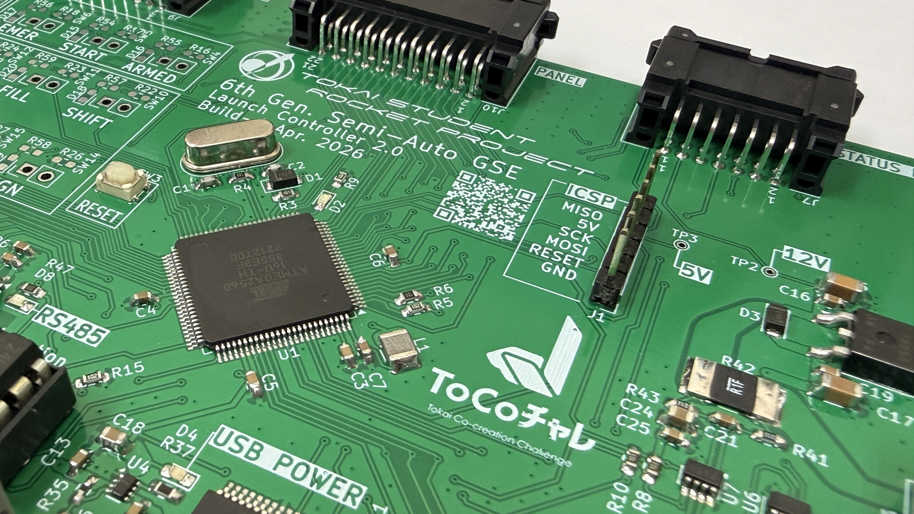

# 第6世代 Ground Support Equipment (GSE)

**2025年3月8日，H-60号機打上げ実験にて運用をし正常に動作したことを確認しました．**

## システムの特徴
- 🔋 **バッテリー給電 & 小型軽量化**: 従来の大型電源を撤廃し、フィールド運用が容易なバッテリー駆動に対応
- ⚡ **Arduino / PlatformIO 開発**: モジュール化された保守性の高いコード構造と自動ライブラリ管理
- 📊 **高精度 N2O 圧力リアルタイム計測**: VESIM10 圧力センサと ADS1115 ADC による遠隔圧力監視
- 🛡️ **フェールセーフ & 安全インターロック**: セミオートマチックシーケンスおよび緊急停止 (E-STOP) 機能

## 📌 バージョン履歴とシステム構成
本リポジトリでは、開発・運用の進展に合わせて以下のバージョンを管理しています。
| バージョン | 主な特徴・追加機能 | ソースファイル | PlatformIO 環境名 |
|---|---|---|---|
| **Gen6 1.0** | **初代実証版** 2025年3月8日 H-60号機打上げ実験にて運用成功。RS485有線通信、セミオートシーケンス | `src/LaunchController/` `src/SatelliteController/` | `[env:Launch]` `[env:Satellite]` |
| **Gen6 2.0** | **安全・安定性強化版** 電磁弁故障検出デバウンス、リミットスイッチ安全ゲート監視、ゼロ点校正の安全判定機能を追加、通信アルゴリズムを最適化 | `src/LaunchController2.0/` `src/SatelliteController2.0/` | `[env:Launch2]` `[env:Satellite2]` |

## ギャラリー
- [2025年3月8日 H-60号機打上げ実験](https://github.com/tokai-student-rocket-project/Gen6-GSE-Elec/blob/main/Documents/Pictures/Gallery/Gallery.md)

## ドキュメント
- [仕様](./Documents/Specification.md)
- [パーツリスト](./Documents/)
- [自動シークエンスタイミングの考え方](./Documents/AutoSequence.md)
- [通信・タスク管理ライブラリについて](./Documents/library_guide.md)
- [亜酸化窒素の圧力計測について](./Documents/VESIM10_Manual.md)
  - [校正シート](./Documents/VESIM10_Calibration.xlsx)
  - [試験成績表(TSRP Only)](https://u-tokai.box.com/s/f19nbcfg3vuwrdxsdca0jw9x3lm8z8kp)

## フォルダ構成

## .pio
: 基本的に自動生成されるため必要ないですが，ライブラリの関係で置いてあります．.pioフォルダの役割は外部ライブラリのインストール先とbuild時のファイル生成先です．（たぶん）

## [Document](./Documents/)
: 資料保管場所として使用しています．できる限りの情報を残せるように頑張ります．
## [include](./include/)
: 特に使用していません．(PlatformIO自動生成)
## [KiCad](./KiCad/)
: サテライトコントローラーランチコントローラーの基板が入っています．フォルダ名の通り，オープンソースのEDAである[KiCad](https://www.kicad.org/)を使用して作成しました．バージョンは 8.0 です．(2025年1月中に9.0へと上がるみたいでびっくりしています．)
## [lib](./lib/)
: ライブラリが入っています．新しくライブラリを作成する際はこちらに収納すると分かりやすいです．(PlatformIO自動生成)
## [src](./src/)
: ランチコントローラーとサテライトコントローラーのソースファイルが入っています．Arduinoで記述していますが，[PlatformIO](https://platformio.org/)の仕様上 .ino ファイルではなく，.cppファイルになっています．(PlatformIO自動生成)
## [test](./test/)
: test機能を使っていないので意味はありません．(PlatformIO自動生成)
## [LICENCE](./LICENSE)
: ライセンスを記載しています．
## [platformio.ini](./platformio.ini)
: PlatformIOを使用するための設定ファイルとなっています．参照：[platform.iniについて](#platforminiについて)

## platform.iniについて

platform.iniはPlatformIOを使用するための設定ファイルです．外部ライブラリがインストールされていなくてもこのplatform.iniファイルに記載があれば自動的にインストールしてくるため環境構築を行いやすくなり，とても便利です．参照：[公式](https://docs.platformio.org/en/latest/projectconf/index.html)

platform.iniファイルにはセクションがあり，それぞれに対してKeyとValueのペアがあります．

> [!NOTE]
> ここの説明を読むより，[公式](https://docs.platformio.org/en/latest/projectconf/index.html)の説明を読んだ方が正確で分かりやすいです！

### サテライトコントローラー
[env:Satellite]
> 環境を示しています．今回はサテライトコントローラーの環境になります．

platform = atmelavr
> 使用するマイコンに合わせています．参照：[公式](https://docs.platformio.org/en/latest/projectconf/sections/env/options/platform/platform.html)

board = ATmega2560
> 使用するマイコンが持つ固有の値を入れています．参照：[公式](https://docs.platformio.org/en/latest/projectconf/sections/env/options/platform/board.html)

framework = arduino
> 使用したいフレームワークを指定しています．参照：[公式](https://docs.platformio.org/en/latest/frameworks/index.html#frameworks)

monitor_speed = 115200
> シリアルモニターのボーレートを指定しています．なお，VScodeの拡張機能である Serial Monitor を使用する場合は拡張機能側で設定する必要があるため関係ありません．

upload_protocol = arduinoisp
> ArduinoISP を使用して書き込むため指定しています．（シリアル変換ICの影響か，USB経由で書き込みができなかったため．つけていて良かった．）

upload_speed = 19200
> ArduinoISP 周りの設定です．
upload_flags = ...
> ArduinoISP 周りの設定です．
upload_command = ...
> ArduinoISP 周りの設定です．

build_src_filter = +<SatelliteController/SatelliteController.cpp>
> env:Satellite の環境に書き込みたいソースファイルを指定できます．

lib_deps = ...
> 外部ライブラリを指定しています．

### ランチコントローラー
[env:Launch]
platform = atmelavr
> 環境を示しています．今回はランチコントローラーの環境になります．

board = ATmega2560
> [platform.ini > サテライトコントローラー参照](#サテライトコントローラー)

framework = arduino
> [platform.ini > サテライトコントローラー参照](#サテライトコントローラー)

monitor_speed = 115200
> [platform.ini > サテライトコントローラー参照](#サテライトコントローラー)

lib_deps = ...
> [platform.ini > サテライトコントローラー参照](#サテライトコントローラー)

build_src_filter = +<LaunchController/LaunchController.cpp>
> [platform.ini > サテライトコントローラー参照](#サテライトコントローラー)

### 手順書
- [せいさくちゅう](./)

### データフロー

- [ランチコントローラー](./Documents/Pictures/DataFlowDiagram/LaunchController_DataFlowDiagram.png)

- [サテライトコントローラー](./Documents/Pictures/DataFlowDiagram/SatelliteController_DataFlowDiagram.png)

## License

Copyright (c) 2025 Tokai Student Rocket Project

This project is licensed under the MIT License. See the [LICENSE](https://github.com/tokai-student-rocket-project/Gen6-GSE-Elec/blob/main/LICENSE) file for mare details.

